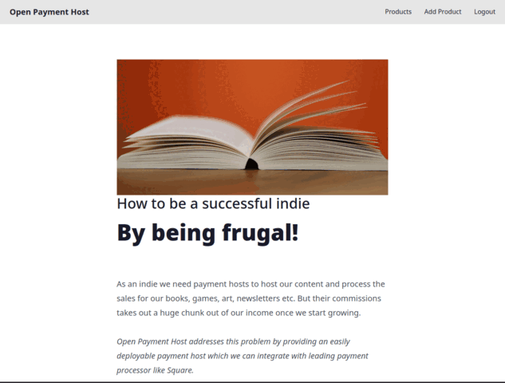

# Open Payment Host  


[](#)
[](#)
[](#)
[](#)
[](#)


Sell Subscriptions, Newsletters, Digital Files without paying commissions.

<p align="center">
    
</p>

## What

Open Payment Host is an easy to run self-hosted, minimalist payments host through which we can easily sell our digital items without paying double commissions while having total control over our sales and data.

## Why

Selling digital items on web as an indie requires using platforms where we have to pay double commissions(to the platform and the payment gateway) and our content is forever locked within those platforms.

## Who

* Those who are looking to self-host an alternative for Gumroad, Buy Me a Coffee, Ko-fi etc.

* Those who churn out lot of projects and don't want to integrate payment gateway every time.

* Those who want to use multiple payment gateways for different countries e.g. for parity pricing or for redundancy.

## How

Open Payment Host is a minimalist yet highly performant Go web application with innovative features which helps indies self-host and sell digital items with little effort.

## One Click Deployment

[](https://railway.com/template/qOF1Ut?referralCode=Bz3_oI)

<!-- ## Video Demo

[](https://www.youtube.com/watch?v=vQcLr-NgqIU)
Clicking the above image would open the video in YouTube. -->

<!-- ## Demo

[https://abishek.openpaymenthost.com](https://abishek.openpaymenthost.com) -->

## Features
- WYSIWYG editor to create beautiful product pages.
- One Time and Subscription payments support.
- Stripe support, Just add the price id for the product and rest is done automatically.
- Paypal support, Just add the plan id for the product and rest is done automatically <sup>new</sup>.
- Razorpay support, Just add the plan id for the product and rest is done automatically <sup>new</sup>.
- Square support, Just add the amount for the product and rest is done automatically.
- Customers can buy without logging in, Increases conversion.
- Multi-country pricing, Price changes automatically according to the user's location resulting in better conversion.
- Light and Dark theme.
- Mailchimp support, Customers are automatically added to a mailchimp list; Useful for sending newsletters.
- File attachment support(images) for the product posts.
- S3 support for delivering digital files via automatic pre-signed URL.
- Subscriber count for the products.
- Automatic SSL and other security features for production.
- Automatic payment gateway router based on country<sup>new</sup>
- API & Webhook <sup>experimental</sup>.

## Production Demo

[https://payments.abishekmuthian.com](https://payments.abishekmuthian.com)

## WIP

This is a work in progress project, although I put lot of effort in ensuring security and stability of the platform users should be aware of possible unknown bugs. That said, I use Open Payment Host as payments host for my own projects.

## Immediate Goals
- [x] Product pages
- [x] Stripe integration
- [x] Square integration
- [x] Paypal integration
- [x] Razorpay integration
- [x] Payment router
- [x] File download
- [ ] Documentation website
- [ ] Accessibility

## Long Term Goals
- [ ] Paddle integration
- [ ] PayU integration
- [ ] Cashfree integration
- [ ] Direct banking API integration
- [ ] Community features
- [ ] Localisation


If you would like to help me achieve these goals, consider sponsoring me

[](https://github.com/sponsors/abishekmuthian)

## Screenshots

### Home


### WYSIWYG editor


### Buy without login

#### Square


### No credit card data is stored locally

#### Stripe


#### Square


### Strong customer authentication (3D-Secure, SCA) support


### File delivery after payment

#### Stripe


#### Square


### Automatic payment gateway router

#### Paypal
https://github.com/user-attachments/assets/41c0d989-4a4f-43e4-8b54-f7938be3dda0

#### Razorpay
https://github.com/user-attachments/assets/86ea6d40-37cf-42f9-81f2-590671baa88c

## Usage

### Requirements

1. [Stripe](https://stripe.com/) or [Square](https://squareup.com) or [Paypal](https://paypal.com) or [Razorpay](https://razorpoay.com) account for payment gateway.

2. [Cloudflare](https://www.cloudflare.com/) account for turnstile captcha.

3. [Mailchimp](https://mailchimp.com/) account for adding subscribers to the list.

Note: Open Payment Host can be tested without fulfilling above requirements, But payments and adding subscribers to the list wouldn't work.

### Docker

The latest image is available on DockerHub at [`abishekmuthian/open-payment-host:latest`](https://hub.docker.com/layers/abishekmuthian/open-payment-host/latest).

### Demo Setup

```bash
mkdir oph-demo && cd oph-demo
sh -c "$(curl -fsSL https://raw.githubusercontent.com/abishekmuthian/open-payment-host/main/samples/oph-demo/install-demo.sh)"
```

Visit `http://localhost:3000`.

Demo version prints more detailed level of errors if any, DO NOT use this demo setup in production.

#### Login

The default admin email id is `admin@openpaymenthost.com` and the password is `OpenPaymentHost`. You'll be asked to reset the password after login for security reasons. That password is hashed and stored.

You'll be logged out after changing password automatically to login with the new credentials.

Admin email id and default admin password can be changed in the config file (explained below) after the first run. Each time the password is reset in the config file, The password needs to be changed again once logged in for security.

### Production Setup

It's recommended to try the demo application first before using the production application. The production application requires a registered domain and special config variables for SSL as detailed in the configuration section.

```bash
mkdir oph-production && cd oph-production
sh -c "$(curl -fsSL https://raw.githubusercontent.com/abishekmuthian/open-payment-host/main/samples/oph-production/install-production.sh)"
```

After the container has started successfully, Stop the container, Set the required production configuration and re-run the container.

### Configuration

Config file `fragmenta.json` is located in the `secrets` folder. It is generated automatically during the first run, After editing the config file the application needs to be restarted for the new configuration to take effect.

`fragmenta.json` contains configuration for both development and production. The production configuration is loaded when the environment variable `FRAG_ENV=production` is set.

Note: Environment variable for production is set automatically when using the docker production setup.

User configurable values are included in the table below.

| Key                                   | Description                                                                                     | Value                                                                               |
| :------------------------------------ | :---------------------------------------------------------------------------------------------- | :---------------------------------------------------------------------------------- |
| admin_email                           | Email id of the administrator.                                                                  | Default: admin@openpaymenthost.com                                                  |
| admin_default_password                | Default password of the administrator, Would be forced to changed after login.                  | Default: OpenPaymentHost                                                            |
| reset_admin                           | Reset the email and password of the admin during the next run.                                  | yes (or) no                                                                         |
| domain                                | Website domain name for the application.                                                        | Dev: localhost, Prod: example                                                       |
| port                                  | Port of the application.                                                                        | Dev: 3000, Prod: 443 (SSL)                                                          |
| root_url                              | FQDN for the application with protocol and port.                                                | Dev: http://localhost:3000, Prod: https://example.com                               |
| autocert_domains                      | Comma separated domains for SSL certificates.                                                   | Demo: NA, Prod: www.example.com, example.com                                        |
| autocert_email                        | email id for SSL certificate related notifications.                                             | Demo: NA, Prod: admin@example.com                                                   |
| autocert_ssl                          | Enable or Disable automatic ssl                                                                 | Demo: NA, Prod: yes/no                                                              |
| name                                  | Name of the website.                                                                            | Default: Open Payment Host                                                          |
| meta_title                            | Title of the website.                                                                           | Default : Sell what you want without paying commissions                             |
| meta_desc                             | Description of the website.                                                                     | Default: Sell Subscriptions, Newsletters, Digital Files without paying commissions. |
| meta_keywords                         | Keywords for the website.                                                                       | Default: payments,subscription,projects,products                                    |
| meta_image                            | URL for the featured image for the website.                                                     | Default: /assets/images/app/oph_featured_image.png                                  |
| meta_url                              | Meta URL for the page when its not generated automatically.                                     | Dev: http://localhost:3000, Prod: https://example.com                               |
| square                                | Enable the square payment gateway, When enabled all other square credentials are mandatory.     | Dev/Prod : yes,no                                                                   |
| square_access_token                   | Square access token for accessing your square account.                                          | Dev: Sandbox access token, Prod: Production access token                            |
| square_app_id                         | Square app id to identify your application.                                                     | Dev: sandbox-..., Production: production app id                                     |
| square_location_id                    | Square location id for the account                                                              | Dev: Sandbox location id from test account, Prod: location id from the main account |
| square_notification_url               | Square notification url for the webhook.                                                        | Dev:Sandbox webhook URL, Prod: Production webhook URL                               |
| square_signature_key                  | Square signature for webhook authentication                                                     | Dev: Sandbox webhook signature, Prod: Production webhook signature                  |
| square_sandbox_source_id              | Square sandbox source id for credit card                                                        | Dev: cnon:card-nonce-ok, Prod:""                                                    |
| square_domain                         | Square API domain                                                                               | Dev: https://connect.squareupsandbox.com/v2, Prod: https://connect.squareup.com/v2  |
| s3_access_key                         | S3 compatible access key                                                                        | Dev: NA,Prod: NA                                                                    |
| s3_secret_key                         | S3 compatible secret key                                                                        | Dev: NA, Prod: NA                                                                   |
| stripe                                | Enable the stripe payment gateway, When enabled all other stripe credentials are mandatory.     | Dev/Prod : yes, no                                                                  |
| stripe_key                            | Stripe developer key.                                                                           | Dev: pk*test*..., Prod: pk*live*...\*\*\*\*                                         |
| stripe_secret                         | Stripe developer secret key.                                                                    | Dev: sk*test*..., Prod: sk*live*...                                                 |
| stripe_webhook_secret                 | Stripe webhook signing secret                                                                   | Dev: whsec_xxx, Prod: whsec_xxx                                                     |
| stripe_tax_rate\_[ISO 3166-1 alpha-2] | Stripe tax id for a country represented by [ ISO 3166-1 alpha-2] code eg. stripe_tax_rate_US    | Dev: txr*..., Prod: txr*...                                                         |
| stripe_callback_domain                | Root URL for callback after Stripe event.                                                       | Dev: [Use tunnel like ngrok], Prod: [Use root_url]                                  |
| subscription_client_country           | Test country for testing multi-country pricing.                                                 | Dev: US, IN, FR etc. Prod: NA                                                       |
| mailchimp_token                       | Mailchimp API Key.                                                                              | e.g. ...-us12                                                                       |
| turnstile_secret_key                  | Cloudflare turnstile secret key for captcha.                                                    | Dev: 1x00000000000000000000AA, Prod: 0x...                                          |
| turnstile_site_key                    | Cloudflare turnstile key for captcha.                                                           | Dev: 1x0000000000000000000000000000000AA, Prod: 0x...                               |
| paypal                                | Enable the paypal payment gateway, When enabled all other paypal credentials are mandatory.     | Dev/Prod : yes,no                                                                   |
| paypal_domain                         | sandbox or production domain domain                                                             | Dev: https://www.sandbox.paypal.com , Prod: https://www.paypal.com                  |
| paypal_api_domain                     | sandbox or production API domain                                                                | Dev: https://api-m.sandbox.paypal.com , Prod: https://api-m.paypal.com              |
| paypal_client_id                      | Paypal client ID                                                                                | Dev: XXX, Prod: XXX                                                                 |
| paypal_client_secret                  | Paypal client secret                                                                            | Dev: XXX, Prod: XXX                                                                 |
| paypal_webhook_id                     | Paypal webhook ID                                                                               | Dev: XXX, Prod: XXX                                                                 |
| razorpay                              | Enable the razorpay payment gateway, when enabled all other razorpay credentials are mandatory. | Dev/Prod: yes                                                                       |
| razorpay_key_secret                   | Razorpay key secret                                                                             | Dev: XXX, Prod: XXX                                                                 |
| razorpay_webhook_secret               | Razorpay webhook secret                                                                         | Dev: XXX, Prod: XXX                                                                 |
| whatsapp_number                       | Whatsapp number for customer support                                                            | Phone number without +,space or dash e.g. 15551234567                               |


### Stripe Webhook Setup

Webhook needs to be setup at [Stripe](https://stripe.com) Developer's section for receiving subscription details post payment.

Set the webhook to `root_url/subscriptions/stripe-webhook` where the root_url is defined in the configuration above. To test the webhooks in the local environment, Use a tunnel like [ngrok](https://ngrok.com/).

Set the following events to send:

1. `checkout.session.completed`
2. `payment_method.attached`
3. `invoice.paid`
4. `invoice.payment_failed`
5. `customer.subscription.deleted`

### Square Webhook Setup

Webhook needs to be setup at [Square](https://developer.squareup.com) Developer's section for receiving subscription details post payment.

Set the webhook to `root_url/subscriptions/square-webhook` where the root_url is defined in the configuration above. To test the webhooks in the local environment, Use a tunnel like [ngrok](https://ngrok.com/).

Set the following events to send:

1. `subscription.created `
2. `subscription.updated `
3. `payment.create`
4. `payment.updated`

### Paypal Webhook Setup 

Webhook needs to be setup at [Paypal](https://developer.paypal.com) Developer's section for receiving subscription details post payment.

Set the webhook to `root_url/subscriptions/paypal-webhook` where the root_url is defined in the configuration above. To test the webhooks in the local environment, Use a tunnel like [ngrok](https://ngrok.com/).

Set the following events to send:

1. `CHECKOUT.ORDER.APPROVED`
2. `CAPTURE.REFUNDED`
3. `BILLING.SUBSCRIPTION.ACTIVATED`
4. `BILLING.SUBSCRIPTION.CREATED`
5. `BILLING.SUBSCRIPTION.UPDATED`
6. `BILLING.SUBSCRIPTION.EXPIRED`
7. `BILLING.SUBSCRIPTION.CANCELLED`
8. `BILLING.SUBSCRIPTION.SUSPENDED`
9. `BILLING.SUBSCRIPTION.PAYMENT.FAILED`

### Razorpay Webhook Setup

Webhook needs to be setup at [Razorpay](https://dashboard.razorpay.com/app/website-app-settings/webhooks) Developer's section for receiving subscription details post payment.

Set the webhook to `root_url/subscriptions/razorpay-webhook` where the root_url is defined in the configuration above. To test the webhooks in the local environment, Use a tunnel like [ngrok](https://ngrok.com/).

Set the following events to send:
1. `order.paid`
2. `subscription.authenticated`
3. `subscription.paused`
4. `subscription.resumed`
5. `subscription.activated`
6. `subscription.pending`
7. `subscription.halted`
8. `subscription.charged`
9. `subscription.cancelled`
10. `subscription.completed`
11. `subscription.updated`

### API and Webhook <sup>Experimental</sup>
> Note: API features are currently supported for Paypal and Razorpay payment gateways only. If you require support for other PG, kindly open a issue.

You can call Open Payment Host for just payments from another website. Once payment is completed the user is redirected back to your website and the payment related data is sent to the webhook mentioned in the product page.

#### Redirect to the OPH product page

`https://<your-oph-domain-for-the-product>?custom_id=<custom-id>&redirect_uri=<redirect-uri>`

#### URL Parameters
`custom_id` : custom id e.g. user id.

`redirect_uri` : redirect URI e.g. success page.

#### Webhook Callback Request

#### Request Header

`X-OPH-Signature` : Signature generated using `SHA-256` with the `webhook secret` as key given in the product page. 

*Note: Generate signature for the webhook request body and compare it with the signature in the header to verify that they are from your Open Payment Host.*

#### Request Body

```
{
    "subscription_id": "xxxx",
    "custom_id": "xxxx",
    "status": "active"
}
```
#### Request Parameters

`subscription_id` : subscription id of the payment. Store it to track the subscription of the user.

`custom_id` : e.g. user id to identify the user and enable subscription features.

`status` : `active` when the subscription is created and `cancelled` when the subscription is cancelled.

#### Cancel Subscription

To cancel the subscription, make a `GET` request.

`https://<your-oph-domain>/subscriptions/cancel?subscription_id=<subscription_id>&redirect_uri=<your-application-domain>&custom_id=<custom-id>`

#### URL Parameters

`subscription_id` : subscription id of the payment.

`redirect_uri` : redirect URI e.g. cancellation success page.

`custom_id` : custom id e.g. user id.

#### Webhook Callback Request

After successful cancellation, OPH will send a webhook POST request to your configured webhook URL.

#### Request Header

`X-OPH-Signature` : HMAC SHA256 signature of the request body using your webhook secret.

#### Request Body

The request body is JSON with the following parameters:

```json
{
  "subscription_id": "sub_xxxxx",
  "custom_id": "your-user-id",
  "status": "cancelled",
  "email": ""
}
```

#### Request Parameters

`subscription_id` : The subscription ID that was cancelled.

`custom_id` : The custom ID (user ID) associated with the subscription.

`status` : Always "cancelled" for cancellation webhooks.

`email` : Email address (may be empty for cancellations).


## Developer

### Build Open Payment Host

To build the application yourself,

```
$ git clone https://github.com/abishekmuthian/open-payment-host
$ cd open-payment-host
$ go build open-payment-host
```

There are `docker-compose` , `Dockerfile` files in the root of the project to build a docker image.

### Tailwind

Open Payment Host uses Tailwind and Daisy UI for its UI.

Compile Tailwind using the following command,

```
npx @tailwindcss/cli -i ./tailwind/tailwind.css -o ./src/app/assets/styles/app.css --watch
```

### License

Copyright (C) 2025 Abishek Muthian (Open Payment Host)

This program is free software: you can redistribute it and/or modify it under the terms of the GNU Affero General Public License as published by the Free Software Foundation, either version 3 of the License, or (at your option) any later version.

This program is distributed in the hope that it will be useful, but WITHOUT ANY WARRANTY; without even the implied warranty of MERCHANTABILITY or FITNESS FOR A PARTICULAR PURPOSE. See the GNU Affero General Public License for more details.

You should have received a copy of the GNU Affero General Public License along with this program. If not, see https://www.gnu.org/licenses/.

### Licenses for open-source libraries used in this project

Fragmenta: https://github.com/fragmenta licensed under [The MIT License](https://github.com/andybrewer/mvp/blob/master/LICENSE).

tailwindcss: https://github.com/tailwindlabs/tailwindcss licensed under [The MIT License](https://github.com/tailwindlabs/tailwindcss/blob/master/LICENSE).

daisyui: https://github.com/saadeghi/daisyui licensed under [The MIT License](https://github.com/saadeghi/daisyui/blob/master/LICENSE).

trix: https://github.com/basecamp/trix licensed under [The MIT License](https://github.com/basecamp/trix/blob/main/LICENSE).

htmx: https://github.com/bigskysoftware/htmx licensed under [Zero-Clause BSD](https://github.com/bigskysoftware/htmx/blob/master/LICENSE).

hyperscript: https://github.com/bigskysoftware/_hyperscript licensed under [Zero-Clause BSD](https://github.com/bigskysoftware/_hyperscript/blob/master/LICENSE).
